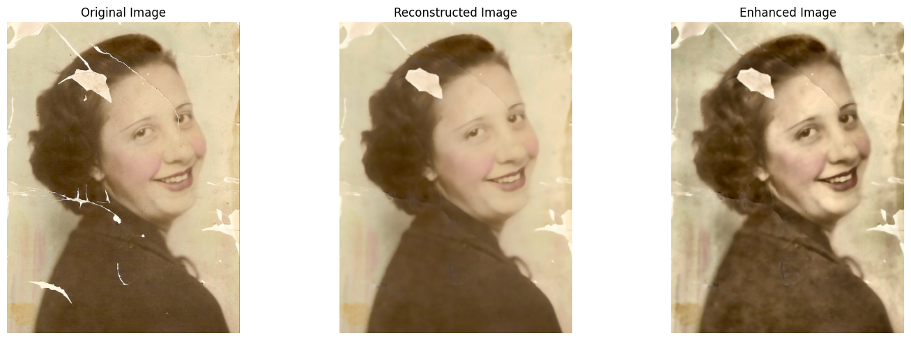

# Digitizing Old Physical Photographs
This project focuses on developing a solution for digitizing and restoring old physical photographs using a combination of traditional computer vision techniques. The goal is to enhance the quality of vintage images, remove noise, and reconstruct missing details to create high-resolution digital versions.

## Project Impact
This project not only contributes to preserving cultural and personal histories by digitizing old photographs but also showcases the effectiveness of traditional computer vision techniques in image restoration. The skills acquired during this project can be applied to various domains involving image enhancement and restoration.

## Methodology and Implementations
Our approach can broadly be divided into four steps - Image Denoising, Scratch Detection, Scratch Inpainting and Image Enhancement. We discuss these steps in detail below along with a sample image. You can go through these steps with any image of your choice using our Jupyter Notebook "CV_Project_Image_Digitizer.ipynb".

1. Image Denoising

   We perform image denoising by using fastN1MeanDenoising - search for all the pixels that really resemble the pixel one wants to denoise. Denoising is then done by computing the average colour of these most resembling pixels. The resemblance is evaluated by comparing a whole window around each pixel, and not just the color.

   

2. Scratch Detection

   - Edge Detection

     We implement Canny Edge Detection to identify most of the edges associated with scratches.
     
     

   - Filtering out Scratches

     We implement a technique to distinguish contours associated with scratches from non-scratch ones. The technique relies on the intuition that the pixel intensity distribution of scratches has a small variance. Closed contours and bounding boxes are then constructed around identified scratches.
     
     

3. Scratch Inpainting
   
   - Creation of Binary Scratch Mask

     To fill in the regions of scratches, we apply morphological closing depending on the average scratch size of the image. The kernel size for such operation is calculated dynamically for each image.
     
     
    
    - Image Reconstruction

      We implement a hybrid technique of Gaussian Pyramid and Telea algorithm to inpaint the scratches. We apply the Binary Scratch Mask on the Denoised Image and inpaint the scratched regions identified. To do so we apply Gaussian Pyramid, inpaint the downsampled image using Telea algorithm, and upsampl the image using cubic interpolation.
      
      

4. Image Enhancement

   We enhance the first reconstructed image using Contrast Limited Adaptive Histogram Equalization (CLAHE) for improved visual quality.

   

### TL;DR

## References
1. [Bringing Old Photos Back to Life](https://doi.org/10.48550/arXiv.2004.09484)
2. [Detection and Removal of Scratches in Images](https://doi.org/10.1007/978-3-319-03844-5_22)

